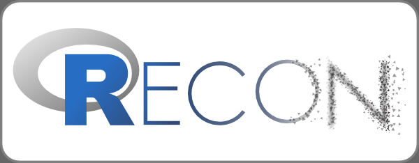

### Different versions of the logo are available

#### Basic

#### Dark background

#### Square

#### Source & redistribution
The RECON logo is distributed under [CC-BY-SA](https://creativecommons.org/licenses/by-sa/4.0/) 4.0. The RECON logo uses the R logo distributed un CC-BY-SA, downloaded from: https://www.r-project.org/logo/ (copyright 2016 The R Foundation).

The changes made to the original R logo are:
* shading of the grey aura, now using a gradient
* shading of the R symbol, now using a gradient
* addition the rest of the logo ('ECON')

Copyright: Thibaut Jombart (thibautjombart@gmail.com), 2016.